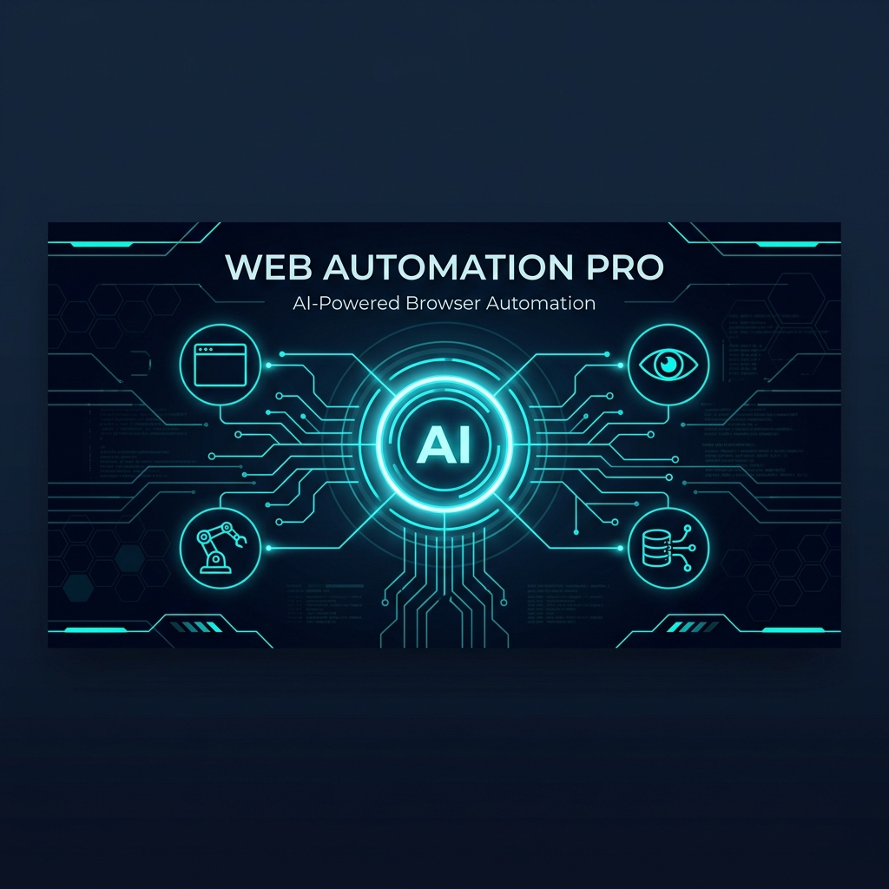
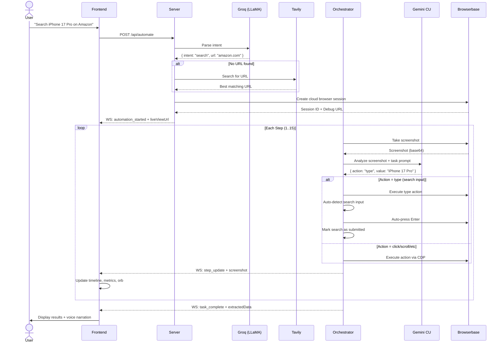
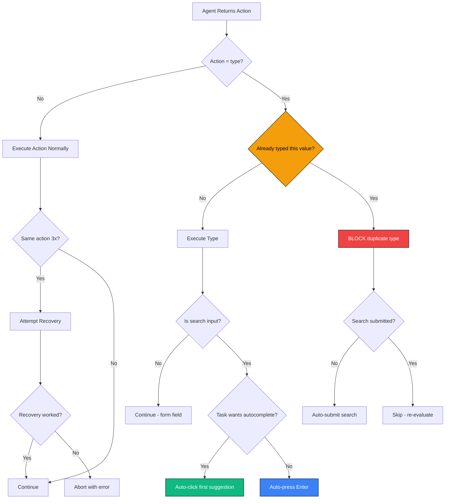

# Agentic-AI-Headless-Browser-Web-Automation-using-Gemini-2.5-and-Browserbase

<p align="center">
  
</p>

<p align="center">
  <strong>Industrial-Grade AI-Powered Browser Automation Framework</strong><br/>
  Powered by Google Gemini Computer-Use, Browserbase Cloud Browsers & Real-Time Dashboard
</p>

<p align="center">
  
  
  
  
  
</p>

---

## 📋 Table of Contents

- [Description](#-description)
- [Key Objectives](#-key-objectives)
- [Technical Stack](#-technical-stack)
- [Architecture](#-architecture)
- [Project Structure](#-project-structure)
- [Execution Steps](#-execution-steps)
- [Usage Examples](#-usage-examples)
- [Advantages](#-advantages)
- [Limitations](#-limitations)
- [License](#-license)

---

## 📖 Description

**Agentic AI Headless Browser Web Automation using Gemini 2.5 and Browserbase** is an industrial-grade, AI-powered web browser automation framework that can understand natural language commands and autonomously execute complex multi-step tasks on **any website** — from e-commerce product research to financial data extraction.

Unlike traditional automation tools that rely on brittle CSS selectors and hardcoded workflows, this system uses **Google Gemini's Computer-Use vision model** to analyze live screenshots of web pages and decide what to do next — just like a human would. It sees the page, understands the context, and takes action.

### What Makes It Different?

| Traditional Automation | Web Automation Pro |
|---|---|
| Requires writing scripts per website | Understands natural language prompts |
| Breaks when UI changes | Uses vision — adapts to any layout |
| Needs CSS selectors / XPaths | Clicks by coordinates like a human |
| Manual error handling | Self-correcting with loop detection |
| No real-time visibility | Live dashboard with AI narration |

### Example Workflow

```
User: "Search for iPhone 17 Pro on Amazon, click the first product, and extract the price"

System: 
  Step 1: Navigate to amazon.com                    ✅
  Step 2: Type "iPhone 17 Pro" in search box         ✅ (auto-presses Enter)
  Step 3: Click first product in results             ✅
  Step 4: Extract price ($1,075.90) + delivery date  ✅
  
Result: { price: "$1,075.90", deliveryDate: "May 13-15" }
```

---

## 🎯 Key Objectives

1. **Universal Website Support** — Works on any website without site-specific code. Uses URL-pattern detection and vision analysis to adapt dynamically.

2. **Natural Language Interface** — Users describe tasks in plain English. The system parses intent, determines the target URL, and executes autonomously.

3. **Self-Correcting Intelligence** — Detects stuck loops (retyping same query, endless scrolling), blocks duplicate actions, and auto-recovers without human intervention.

4. **Real-Time Observability** — Apple-inspired dashboard with live browser view, step-by-step timeline, screenshot gallery, and AI voice narration (J.A.R.V.I.S.-style).

5. **Cloud-Native Execution** — Runs on Browserbase cloud browsers with anti-bot stealth, eliminating the need for local Chrome installations or proxy management.

6. **Production Reliability** — Session crash recovery, navigation timeout resilience, overlay/popup auto-dismissal, and auth-wall detection.

---

## 🛠 Technical Stack

### Backend (Node.js)

| Technology | Purpose | Version |
|---|---|---|
| **Node.js** | Runtime environment | ≥ 20.0 |
| **Express.js** | REST API server | v5.2 |
| **WebSocket (ws)** | Real-time event streaming to frontend | v8.20 |
| **Puppeteer** | Browser automation protocol (CDP) | v22.15 |
| **Puppeteer Stealth** | Anti-bot fingerprint randomization | v2.11 |
| **@google/genai** | Gemini Vision & Computer-Use API | v1.52 |
| **Groq SDK** | Ultra-fast intent parsing (LLaMA 3.3 70B) | v1.1 |
| **Axios** | HTTP client for Tavily search + Browserbase API | v1.15 |
| **Winston** | Structured logging with file rotation | v3.19 |
| **dotenv** | Environment configuration management | v17.4 |

### Frontend (React + Vite)

| Technology | Purpose | Version |
|---|---|---|
| **React** | UI component library | v19.2 |
| **Vite** | Build tool & dev server | v8.0 |
| **Recharts** | Analytics charts in Dashboard | v3.8 |
| **Lucide React** | Icon library | v1.14 |
| **Web Speech API** | AI voice narration (browser-native TTS) | Native |
| **CSS3** | Custom glassmorphism design system | — |

### Cloud Services

| Service | Purpose |
|---|---|
| **Browserbase** | Cloud browser infrastructure (anti-bot, stealth, scalable) |
| **Google Gemini 2.5 Computer-Use** | Vision-based screenshot analysis & action planning |
| **Groq Cloud** | Sub-second intent parsing with LLaMA 3.3 70B |
| **Tavily Search API** | URL discovery when user prompt doesn't contain a URL |

---

## 🏗 Architecture

### High-Level System Architecture

```mermaid
flowchart TB
    subgraph Frontend["🖥️ Frontend (React + Vite)"]
        UI[AutoPilot Dashboard]
        CMD[Command Bar]
        ORB[AI Orb Visualizer]
        TL[Task Timeline]
        LT[Live Terminal]
        LB[Live Browser iFrame]
        SS[Screenshot Viewer]
        VOICE[Voice Engine / TTS]
    end

    subgraph Backend["⚙️ Backend (Node.js + Express)"]
        SRV[Server.js - Express + WebSocket]
        IR[Intent Router - Groq LLaMA]
        TV[Tavily URL Search]
        WA[Website Analyzer]
        TV2[Task Validator]
        
        subgraph Orchestrator["🧠 Task Orchestrator (Brain)"]
            ORCH[Step Loop Controller]
            GUARD[Stuck Loop Detection]
            AUTO[Auto-Submit Intelligence]
            HIST[Rich History Tracker]
        end
        
        subgraph Agents["🤖 AI Agents"]
            AR[Agent Reasoning Router]
            VA[Vision Analyzer - Gemini Flash]
            CUA[Computer-Use Agent - Gemini CU]
            PB[Prompt Builder]
        end
        
        subgraph Execution["🔧 Execution Layer"]
            TE[Tool Executor]
            SM[Scroll Manager]
            VG[Viewport Guard]
        end
    end

    subgraph Cloud["☁️ Cloud Infrastructure"]
        BB[Browserbase Cloud Browser]
        GEMINI[Google Gemini API]
        GROQ[Groq Cloud API]
        TAV[Tavily Search API]
    end

    CMD -->|User Prompt| SRV
    SRV -->|Parse Intent| IR
    IR -->|LLaMA 3.3| GROQ
    IR -->|URL Search| TV
    TV --> TAV
    SRV -->|Analyze Site| WA
    SRV -->|Validate Task| TV2
    SRV -->|Start Automation| ORCH
    
    ORCH -->|Screenshot| BB
    ORCH -->|Analyze Screenshot| AR
    AR -->|Vision| VA
    AR -->|Computer-Use| CUA
    VA --> GEMINI
    CUA --> GEMINI
    AR --> PB
    
    ORCH -->|Execute Action| TE
    TE -->|CDP Commands| BB
    TE --> SM
    TE --> VG
    
    ORCH -->|Guard Checks| GUARD
    ORCH -->|Post-Type| AUTO
    ORCH -->|Track Actions| HIST
    
    SRV -->|WebSocket Events| UI
    UI --> ORB
    UI --> TL
    UI --> LT
    UI --> LB
    UI --> SS
    UI --> VOICE
    
    LB -->|Debug URL iFrame| BB

    style Frontend fill:#0f172a,stroke:#00ffcc,color:#e2e8f0
    style Backend fill:#1e293b,stroke:#3b82f6,color:#e2e8f0
    style Cloud fill:#1a1a2e,stroke:#f59e0b,color:#e2e8f0
    style Orchestrator fill:#0c1426,stroke:#8b5cf6,color:#e2e8f0
    style Agents fill:#0c1426,stroke:#10b981,color:#e2e8f0
    style Execution fill:#0c1426,stroke:#ef4444,color:#e2e8f0
```



### Request Lifecycle



### Self-Correcting Intelligence Flow



---

## 📁 Project Structure

```
web-automation-pro-v6.1/
├── server.js                    # Express + WebSocket server entry point
├── package.json                 # Backend dependencies & scripts
├── .env                         # Environment configuration (API keys, timeouts)
├── .env.example                 # Template for environment setup
├── .gitignore                   # Git ignore rules
│
├── src/                         # ── Backend Source Code ──
│   ├── main.js                  # Automation entry point (CLI + API)
│   ├── intent-router.js         # Groq LLaMA intent parser + Tavily URL search
│   ├── website-analyzer.js      # Site profiling (known sites + dynamic analysis)
│   ├── task-validator.js        # Input validation & complexity scoring
│   ├── task-orchestrator.js     # 🧠 Core brain — step loop, guards, auto-submit
│   ├── agent-reasoning.js       # Agent router (Vision vs Computer-Use)
│   ├── vision-analyzer.js       # Gemini Flash vision analysis
│   ├── computer-use-agent.js    # Gemini Computer-Use multi-turn agent
│   ├── prompt-builder.js        # Unified prompt construction (single source of truth)
│   ├── tool-executor.js         # Action execution (click, type, scroll, navigate)
│   ├── viewport-guard.js        # Overlay suppression, scroll protection
│   ├── scroll-manager.js        # Intelligent scroll management
│   ├── browser-manager.js       # Local Puppeteer browser management
│   ├── browserbase-manager.js   # Browserbase cloud browser integration
│   ├── logger.js                # Winston logger with WebSocket broadcasting
│   └── ws-broadcaster.js        # WebSocket event relay
│
├── config/                      # ── Configuration ──
│   └── environment-loader.js    # Dynamic environment validation
│
├── frontend/                    # ── React Frontend (Vite) ──
│   ├── package.json
│   ├── vite.config.js
│   └── src/
│       ├── App.jsx              # Main application with WebSocket integration
│       ├── App.css              # Global styles
│       ├── index.css            # Design system tokens
│       ├── main.jsx             # React entry point
│       ├── components/
│       │   ├── AiOrb.jsx/css        # Animated AI orb (idle/thinking/automating/success/error)
│       │   ├── CommandBar.jsx/css    # Spotlight-style command input
│       │   ├── Dashboard.jsx/css     # Analytics dashboard with session history
│       │   ├── LiveTerminal.jsx/css  # Real-time server log viewer
│       │   ├── MetricsPanel.jsx/css  # Status bar (step, confidence, mode)
│       │   ├── ScreenshotViewer.jsx  # Step-by-step screenshot gallery
│       │   ├── Settings.jsx/css      # Configuration panel
│       │   ├── Subtitles.jsx/css     # Voice narration subtitle overlay
│       │   ├── TaskTimeline.jsx/css  # Step timeline with status indicators
│       │   └── WelcomeSplash.jsx/css # Activation splash screen
│       └── services/
│           └── VoiceEngine.js       # Browser TTS with J.A.R.V.I.S.-style narration
│
├── cache/                       # Screenshot cache (auto-generated)
├── logs/                        # Winston log files (auto-generated)
├── reports/                     # Task execution reports (auto-generated)
├── data/                        # Persistent data storage
├── selectors/                   # CSS selector configs
└── prompts/                     # Prompt templates
```

---

## 🚀 Execution Steps

### Prerequisites

- **Node.js** ≥ 20.0.0 ([Download](https://nodejs.org/))
- **npm** ≥ 10.0.0
- API keys for: **Google Gemini**, **Browserbase**, **Groq**, **Tavily**

### 1. Clone the Repository

```bash
git clone https://github.com/your-username/web-automation-pro-v6.1.git
cd web-automation-pro-v6.1
```

### 2. Install Dependencies

```bash
# Backend
npm install

# Frontend
cd frontend && npm install && cd ..
```

### 3. Configure Environment

```bash
# Copy the example environment file
cp .env.example .env
```

Edit `.env` with your API keys:

```env
# Gemini API
GEMINI_API_KEY=your_gemini_api_key
GEMINI_COMPUTER_USE_MODEL=gemini-2.5-computer-use-preview-10-2025

# Browserbase
USE_BROWSERBASE=true
BROWSERBASE_API_KEY=your_browserbase_api_key
BROWSERBASE_PROJECT_ID=your_project_id

# Groq (Intent Parsing)
GROQ_API_KEY=your_groq_api_key

# Tavily (URL Discovery)
TAVILY_API_KEY=your_tavily_api_key
```

### 4. Start the Application

```bash
# Start both backend server and frontend dev server
npm run dev:all
```

This launches:
- **Backend**: `http://localhost:3001` (Express + WebSocket)
- **Frontend**: `http://localhost:5173` (Vite dev server)

### 5. Open the Dashboard

Navigate to `http://localhost:5173` in your browser. Click the splash screen to activate, then type your automation command in the command bar at the bottom.

### Alternative: CLI Mode

```bash
# Direct CLI execution
node src/main.js --url "https://www.amazon.com" --task "Search for laptop stand and extract the first product price"

# With Browserbase cloud browser
npm run websites
```

---

## 💡 Usage Examples

| Prompt | What It Does |
|---|---|
| `Search for iPhone 17 Pro on Amazon, click the first product, and extract the price` | Navigates → searches → clicks → extracts product data |
| `Go to Yahoo Finance, type TSLA, click the first autocomplete suggestion, and summarize the page` | Finance data extraction with autocomplete interaction |
| `Navigate to YouTube and search for 'Interstellar theme music', play the first video` | Video platform navigation and interaction |
| `Open booking.com, search for hotels in Paris for June 15-20` | Travel site automation with date selection |
| `Go to GitHub and find the most starred Python repositories` | Developer tool navigation and data extraction |

---

## ✅ Advantages

### 1. **Zero-Code Automation**
No programming required. Users describe tasks in natural language and the system figures out the rest — URL discovery, navigation, interaction, and data extraction.

### 2. **Universal Website Compatibility**
Works on **any website** without site-specific scripts. The vision model adapts to any UI layout, making it resilient to design changes that break traditional selector-based automation.

### 3. **Self-Correcting Intelligence**
- **Never-type-twice guard**: Prevents infinite search loops
- **Auto-submit after search**: System handles Enter/autocomplete automatically
- **Consecutive scroll limiter**: Forces completion when enough data is collected
- **Stuck loop recovery**: Attempts recovery before aborting

### 4. **Real-Time Observability**
Full visibility into the automation process through:
- Live browser view (embedded Browserbase session)
- Step-by-step task timeline with reasoning
- Screenshot gallery for visual debugging
- Live terminal with server logs
- AI voice narration of each step

### 5. **Cloud-Native & Scalable**
Browserbase cloud browsers eliminate local Chrome dependencies, provide built-in anti-bot stealth, and support parallel execution across multiple sessions.

### 6. **Multi-Model AI Pipeline**
Leverages the best model for each job:
- **Groq LLaMA 3.3 70B**: Ultra-fast intent parsing (< 500ms)
- **Gemini 2.5 Flash**: Quick visual analysis for simple tasks
- **Gemini Computer-Use**: Multi-turn reasoning for complex interactions
- **Tavily Search**: Web search for URL discovery

### 7. **Production-Grade Error Handling**
- Navigation timeout resilience (continues on partial page loads)
- Browser session crash recovery with data preservation
- Auth-wall detection (aborts cleanly when login is required)
- Overlay/popup auto-dismissal (cookie banners, consent dialogs)

---

## ⚠️ Limitations

### 1. **API Cost & Rate Limits**
Each step requires a Gemini API call with a screenshot (~$0.002-0.01 per call). A 15-step task costs approximately $0.03-0.15. Browserbase sessions have usage-based pricing. High-volume automation can become expensive.

### 2. **Vision Model Accuracy**
The Gemini vision model occasionally:
- Misidentifies UI elements (clicks wrong button)
- Fails to read small or low-contrast text
- Struggles with highly dynamic content (animations, video players)
- May not correctly interpret complex layouts (multi-column, nested scrolls)

### 3. **No Login/Authentication Support**
The system cannot log into websites. Tasks requiring authentication will be detected and aborted. Workaround: Pre-authenticate the Browserbase session manually.

### 4. **Speed Constraints**
Each step takes 8-15 seconds (screenshot capture + API call + execution). A full task typically takes 1-3 minutes. This is slower than hardcoded scripts but the trade-off is universality.

### 5. **Anti-Bot Detection**
Despite stealth plugins, some websites (e.g., Cloudflare-protected sites) may still detect and block the automated browser. Browserbase mitigates this but doesn't guarantee 100% bypass.

### 6. **No Complex Form Filling**
While the system can type text into inputs, multi-step forms with date pickers, dropdowns, file uploads, and CAPTCHA challenges are not reliably handled.

### 7. **Single-Tab Execution**
The current architecture supports one browser tab per task. Tasks requiring multi-tab workflows (e.g., comparing products in different tabs) are not supported.

### 8. **Internet Dependency**
Requires stable internet connectivity for Gemini API, Groq API, Tavily API, and Browserbase cloud browsers. Offline operation is not supported.

---

## 📄 License

This project is licensed under the **MIT License** — see the [LICENSE](LICENSE) file for details.

---

<p align="center">
  Built with ❤️ using <strong>Google Gemini</strong>, <strong>Browserbase</strong>, <strong>Groq</strong> & <strong>React</strong>
</p>

